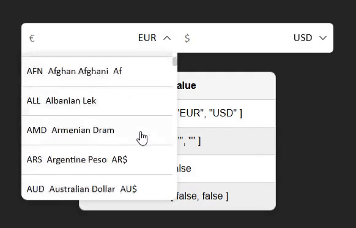

# 💸 Vue Currency Converter

Vue 3.x component for currency conversion with customizable styles and configurable API endpoints for data fetching.

## Install

```bash
npm i vue-currency-converter
# or
npm i vue-currency-converter
# or
pnpm i vue-currency-converter
```

## Demo ❤️

<div align="center">
  
</div>

## Playground 🚀

[Open the online Playground on StackBlitz](https://stackblitz.com/edit/vue-currency-converter?file=src%2FApp.vue)

Try out the component live, tweak props, and experiment with integration directly in your browser.

## Documentation 📚

[View full documentation site](https://markminerov.github.io/vue-currency-converter/) — guides, API reference, and more examples.

## Features

- Configurable API for currency conversion rates
- Default API included
- Component can be styled with css variables
- No dependencies
- Ready-to-use with pre-written styles

## Quick Start

```vue
<script setup lang="ts">
import { ref } from "vue";
import type { Model } from "vue-currency-converter";
import CurrencyConverter from "vue-currency-converter";
import "vue-currency-converter/style.css";

const model = ref<Model>({
  currencies: ["EUR", "USD"],
});
</script>

<template>
  <CurrencyConverter v-model="model" />
</template>
```

## Props

| Prop         | Type                  | Default   | Description                                                                                                                             |
| ------------ | --------------------- | --------- | --------------------------------------------------------------------------------------------------------------------------------------- |
| `modelValue` | `CurrencyInputModel`  | — (req)   | Bound value for `v-model`. Holds the current state of the currency input.                                                               |
| `listConfig` | `Partial<ListParams>` | see below | Configuration for the currency list / behavior. Any subset of `ListParams`. Unspecified fields fall back to component defaults (below). |
| `itemHeight` | `number`              | —         | Fixed pixel height for each item row (overrides CSS var–driven sizing if provided).                                                     |
| `size`       | `Size`                | —         | Component size token used by your design system (e.g., `sm`, `md`, …). Controls overall spacing/row heights via CSS vars.               |
| `disabled`   | `boolean`             | `false`   | Disables user interaction with the input and list.                                                                                      |

### `listConfig`

| Key                   | Type             | Default                  | Description                                                       |
| --------------------- | ---------------- | ------------------------ | ----------------------------------------------------------------- |
| `itemsPerView`        | `number`         | `DEFAULT_ITEMS_PER_VIEW` | How many items are visible in the scroll viewport.                |
| `itemHeight`          | `number`         | —                        | Per-item row height (px). If omitted, size/CSS vars are used.     |
| `availableCurrencies` | `CurrencyCode[]` | —                        | Optional allowlist of currencies to display.                      |
| `animationName`       | `string`         | —                        | Custom CSS animation name for list transitions.                   |
| `reverse`             | `boolean`        | `false`                  | Reverses list order.                                              |
| `needFormat`          | `boolean`        | `true`                   | Whether to live-format typed values (e.g., thousands separators). |
| `openBlocked`         | `boolean`        | `false`                  | If `true`, prevents opening the dropdown/list.                    |
| `item.hideCode`       | `boolean`        | `false`                  | Hide the currency code (e.g., `USD`).                             |
| `item.hideName`       | `boolean`        | `false`                  | Hide the currency name (e.g., “US Dollar”).                       |
| `item.hideSymbol`     | `boolean`        | `false`                  | Hide the currency symbol (e.g., `$`).                             |

### Related types

```ts
type ListParams = {
  itemsPerView: number;
  itemHeight: number;
  availableCurrencies: CurrencyCode[];
  animationName: string;
  reverse: boolean;
  needFormat: boolean;
  openBlocked: boolean;
  item: {
    hideCode: boolean;
    hideName: boolean;
    hideSymbol: boolean;
  };
};
```

> `listConfig` is `Partial<ListParams>`, so you can pass only what you need; unspecified fields use the defaults listed above.

## Slots

| Slot             | Props | Description                                                                                               |
| ---------------- | ----- | --------------------------------------------------------------------------------------------------------- |
| `header:before`  | —     | Content rendered **before** the header (inside the input header area). Useful for adding icons or labels. |
| `header:after`   | —     | Content rendered **after** the header. Good for action buttons or extra UI elements.                      |
| `header:chevron` | —     | Replaces the default dropdown chevron icon in the header.                                                 |
| `item:before`    | —     | Content rendered **before** each list item (e.g., prepend icon/flag).                                     |
| `item:after`     | —     | Content rendered **after** each list item (e.g., trailing action or badge).                               |

## Emits

| Event               | Payload                        | Description                                                                                        |
| ------------------- | ------------------------------ | -------------------------------------------------------------------------------------------------- |
| `setCurrencies`     | `[CurrencyCode, CurrencyCode]` | Emitted when the active currency pair changes (e.g., user selects different “from/to” currencies). |
| `update:modelValue` | `Model`                        | Standard `v-model` update event. Emits the updated component state/value.                          |
| `request:error`     | `unknown`                      | Emitted when a rate-fetching request fails. The payload contains the error object/response.        |
| `request:success`   | `ApiData`                      | Emitted when a rate-fetching request succeeds. The payload contains the API response data.         |

## Types

```ts
// 'USD' | 'EUR' | 'CAD' | ...
export type CurrencyCode = keyof typeof currencyJson;

export interface CurrencyConfig {
  symbol: string;
  name: string;
  symbol_native: string;
  decimal_digits: number;
  rounding: number;
  code: CurrencyCode;
  name_plural: string;
}

export type ListParams = {
  itemsPerView: number;
  itemHeight: number;
  availableCurrencies: CurrencyCode[];
  animationName: string;
  reverse: boolean;
  needFormat: boolean;
  openBlocked: boolean;
  item: {
    hideCode: boolean;
    hideName: boolean;
    hideSymbol: boolean;
  };
};

export interface CurrencyInputModel {
  currency: CurrencyCode;
  value: string;
}

export type ApiData = Partial<
  Record<CurrencyCode, Record<CurrencyCode, number>>
>;

export type ApiConfig = {
  cache: number;
  fetchOptions: RequestInit;
  disabled: boolean;
  url: {
    base: string;
    builder: (url: string, code?: CurrencyCode) => string;
  };
  setter: (response: any, mutable: Ref<ApiData>) => void;
};

export interface RequiredModel {
  currencies: [CurrencyCode, CurrencyCode];
  values: [string, string];
  hasFocus: [boolean, boolean];
  loading: boolean;
}

export type Model = Partial<RequiredModel>;

export type InternalApiData = Ref<ApiData>;

export interface DefaultApiResponse {
  base_code: CurrencyCode;
  rates: Record<CurrencyCode, number>;
}

export type Size = "sm" | "md" | "lg" | "xl" | "xxl";
```

## 🤝 Contributing

Contributions are very welcome! You can help by fixing bugs, improving docs, or adding features.

1. Fork the repo and create a new branch
2. `npm i` to install dependencies
3. `npm watch:build` to build the project JIT
4. `npm link` in directory folder
5. `npm link vue-tel-num-input` in your project directory
6. Commit your changes and push your branch 😍
7. Create Pull-Request
8. Thank you

For UI changes please include screenshots or gifs so it’s easy to review 🥹

👉 Bug reports and feature requests should be submitted as GitHub Issues.

## 🚧 Project Status

This component is currently in beta.
The API and behavior may still change before a stable release.

If you encounter any bugs, unexpected behavior, or have feature requests:
👉 please open an issue on [GitHub](https://github.com/MarkMinerov/vue-currency-converter/issues)

Your feedback will help improve and stabilize the component for production use.

## License

MIT © 2025 Mark Minerov

```

```
